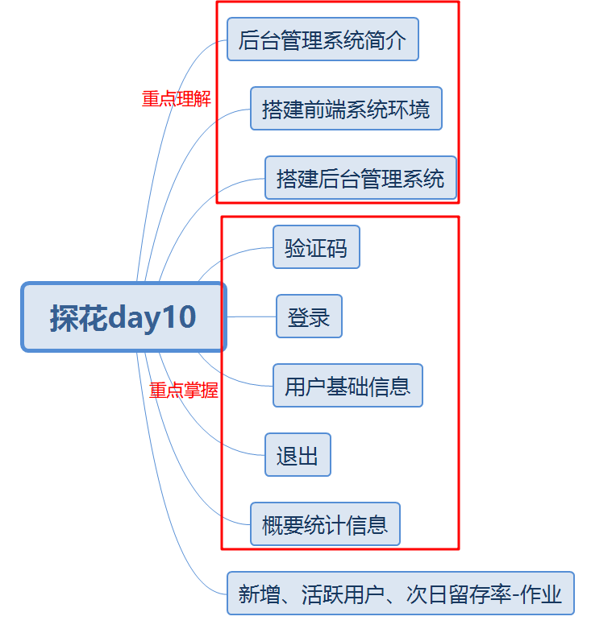
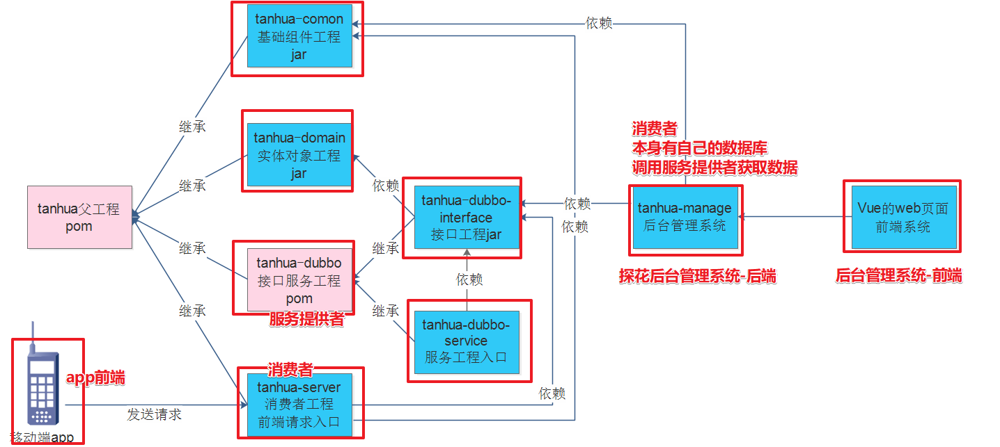
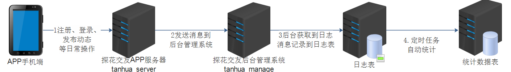
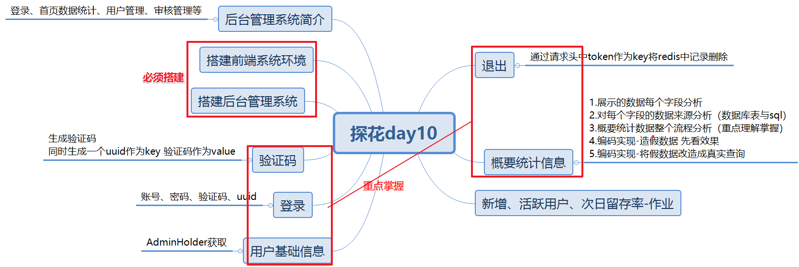

# 今日内容介绍

# 探花后台管理系统功能介绍

核心功能：登录、首页数据统计、用户管理、审核管理等

# 前端工程环境搭建

注意：

1.解压后一定要放到非中文 非空格 目录下

2.如果不能正常启动，可以以管理员身份运行

3.nginx.conf    listen  8088:访问端口 

4.访问/management 跳转到http://127.0.0.1:18083/（后台管理系统-后端端口）

# 登录-发送验证码

1. 后台管理系统-前端页面发送

   http://127.0.0.1:8088/management/system/users/verification?uuid=211521a3-0be6-4e65-b51a-d3f3c63eb5c1

   实际路径：

   http://127.0.0.1:18083/system/users/verification?uuid=211521a3-0be6-4e65-b51a-d3f3c63eb5c1

2. uuid相当于探花app登录的手机号码

3. 后台管理系统接收到请求后，以uuid作为key 通过hutool生成的验证码作为值 存入redis.

# 登录

1. 发送登录请求 账号（用户名） 密码 验证码 uuid
2. 校验验证码  根据uuid从redis查询验证码   跟 传入的验证码 对比
3. 先校验用户名  根据传入用户名 查询tb_admin表 记录是否存在
4. 再校验密码 根据数据库查询的密码 跟 传入的密码 对比
5. 生成token存入redis

# 概要统计信息

## 需求分析

累计用户数：注册了多少用户

过去7天活跃用户数：只要登录过的用户  操作功能了

过去30天活跃用户数：只要登录过的用户 操作功能了

今日新增用户数：当天注册用户数  

   		环比下降 上升：昨天的注册用户数 跟 今日的注册用户数 计算

今日登录次数：当天有多少用户登录了

​		环比下降 上升：昨天的用户登录次数 跟 今日的用户登录次次数 计算

今日活跃用户数：只要登录过的用户  操作功能了

​		环比下降 上升：昨天的活跃用户数 跟 今日的活跃用户数 计算

## 数据库表

tb_analysis_by_day：概要统计分析表

record_date:时间唯一的 每一天只会有一条记录

## 编码分析

1. controller接收请求 返回AnalysisSummaryVo

2. controller调用service业务处理

   **累计用户数:** select sum(num_registered) from tb_analysis_by_day 

   **过去30天活跃用户数:**select sum(num_active) from tb_analysis_by_day  where record_date >='2021-06-12' and record_date <='2021-07-12'

   **过去7天活跃用户:**select sum(num_active) from tb_analysis_by_day  where record_date >='2021-07-05' and record_date <='2021-07-12'

   **今日新增用户数量:**select sum(num_registered) from tb_analysis_by_day  where record_date >='2021-07-12' and record_date <='2021-07-12'

   **今日新增用户涨跌率:**

   今日：select sum(num_registered） from tb_analysis_by_day  where record_date >='2021-07-12' and record_date <='2021-07-12'

   昨天：select sum(num_registered） from tb_analysis_by_day  where record_date >='2021-07-11' and record_date <='2021-07-11'

   **今日登录次数：**select sum(num_login）from tb_analysis_by_day  where record_date >='2021-07-12' and record_date <='2021-07-12'

   **今日登录次数涨跌率**

   今日：select sum(num_login） from tb_analysis_by_day  where record_date >='2021-07-12' and record_date <='2021-07-12'

   昨天：select sum(num_login）from tb_analysis_by_day  where record_date >='2021-07-11' and record_date <='2021-07-11'

   **今日活跃用户数量：**select sum(num_active） from tb_analysis_by_day  where record_date >='2021-07-12' and record_date <='2021-07-12'

   **今日活跃用户涨跌率**

   今日：select sum(num_active） from tb_analysis_by_day  where record_date >='2021-07-12' and record_date <='2021-07-12'

   昨天：select sum(num_active） from tb_analysis_by_day  where record_date >='2021-07-11' and record_date <='2021-07-11'

3. 将数据封装AnalysisSummaryVo返回

## 测试

# 总结

# 演讲

说一说概要统计信息整个流程？

